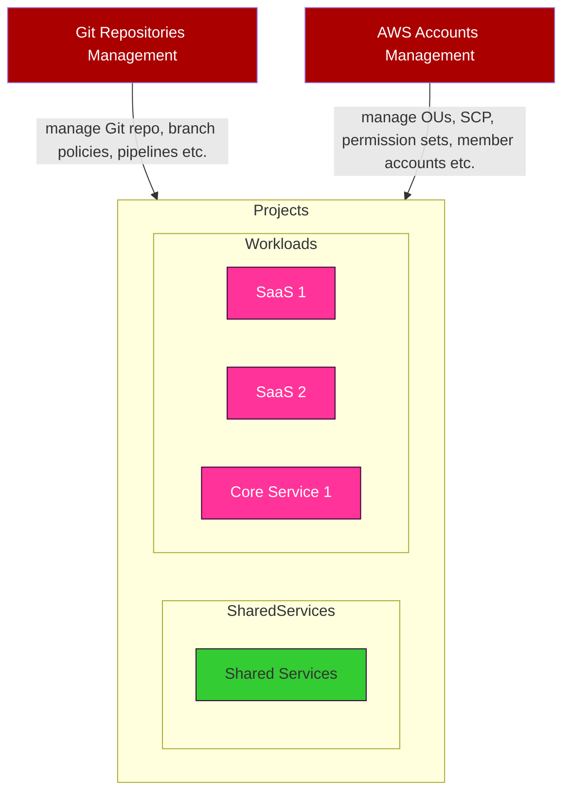
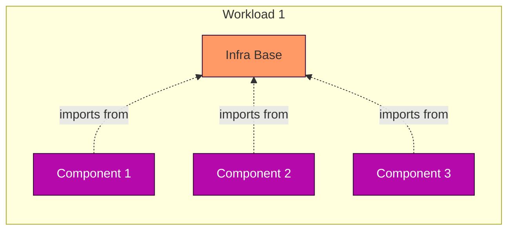
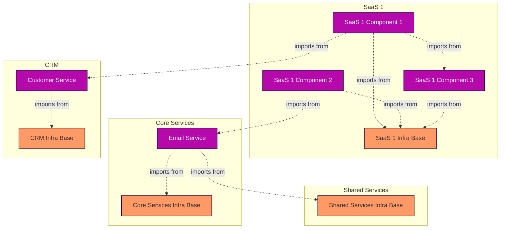

Edit: Thanks to the initial feedback I've got for my very first blog post, I modified this blog post at 04/07/2024 01:15 pm BST to clarify some missing points.

## Introduction

Starting my IT career in banking, I became passionate about fast, high-quality software delivery.

At [Xecuta](https://www.xecuta.co.uk), where we build multiple SaaS products, we embraced organized software delivery early, focusing on robust architecture principles to manage AWS resources effectively.

In this series' first part, I’ll discuss our architecture principles and design thinking that guided us in organizing our AWS environments and choosing tools and services.

## Xecuta's Architecture Principles

Before writing any code, we established these ten principles:

1. **Cloud-native and Serverless Architectures:** To achieve agility and minimize operational expenses.
2. **AWS as the Backbone:** Leveraging the best public cloud services for our needs.
3. **Organized AWS Environment:** Using AWS Organizations and following AWS’s recommended patterns1.
4. **Infrastructure-as-Code (IaC):** Managing not just cloud infrastructure but also AWS accounts, Git repositories, and CI/CD pipelines.
5. **Security from Day Zero:** Utilizing SSO and cost-effective security services.
6. **Open Source Software:** Commitment from the beginning.
7. **Keep It Simple, Stupid (KISS):** Simplicity in design and execution.
8. **[Twelve-Factor App Methodology](https://12factor.net/):** Ensuring best practices in app development.
9. **Continuous Delivery:** Emphasizing static code analysis, trunk-based development, and regular code re-deployments.
10. **Build Once, Deploy Many**: Consistent builds to produce immutable build artefacts using automation for semantic versioning and changelogs.

1 We adopted AWS recommended [Basic Organization with infrastructure services](https://docs.aws.amazon.com/whitepapers/latest/organizing-your-aws-environment/basic-organization.html#basic-organization-with-infrastructure-services) pattern. You may also want to look at [Basic organization with CI/CD as a separate function](https://docs.aws.amazon.com/whitepapers/latest/organizing-your-aws-environment/basic-organization.html#basic-organization-with-cicd-as-a-separate-function). We decided Infrastructure OU can enclose Deployments OU for simplicity.

## Current Status

As of now, Xecuta has:

- 15 AWS Accounts
- 30+ Git repositories, CI/CD pipelines and on-demand deploy pipelines
- 2 multi-tenant SaaS offerings with multiple customers and environments
- High code quality with 80% code coverage, OSS vulnerabilities scanning and policy-as-code for IaC
- A lean team of one full-time and one-part time developer

> AWS bill for **non-workload OUs** last month was only **$19.90**

---

## Day Zero Plan

We began by organizing our AWS accounts and resources, with a single AWS account as the management account and using IAM Identity Center for SSO. We manage organization OUs and member accounts with IaC, using two repositories for AWS accounts and Git repositories management.

Our system administrators should be able to apply infrastructure-as-code changes from their local workstations, which will be authorized by temporary credentials issued by SSO (IAM Identity Center).

I'm planning to cover _Shared Services_ in the series' second part. For the time being, let's assume we have a Shared Services account, it has the basic architecture set up and it provides some level of build and deployment capabilities.

To avoid a chicken or eggs situation, Shared Services will also be managed by the system administrators using infrastructure-as-code from their local workstations. Since Shared Services account will host the infrastructure for our build jobs and CI/CD pipelines, everything else on AWS cloud will be fully automated through pipelines.

---

## Workload Infrastructure Base

Our design thinking on how we should organize our AWS resources led us to several questions, such as:

- If a KMS key is used to encrypt and decrypt messages across all SQS queues in an AWS account, where should the key be maintained and who should maintain it
- There may be some AWS services like VPCs that our developers can be hands-off, or we may want to restrict their maintenance to a smaller set of people, such as DevOps engineers only
- How can we control dependencies in an ecosystem with many microservices and avoid cyclic dependencies
- How can we keep the number of dependencies between microservices at a minimum, so they continue to be easily disposable

**Workload Infrastructure Base** is our answer to this problem.

A workload can be either a SaaS or a core service. A core service, such as CRM or Invoicing, is part of the company's platform, which serves all SaaS offered by the company.

A component represents a microservice, or a miniservice, in which we manage only the compute resources, gateways and event mappings. Anything else is managed in Workload Infrastructure Base, which can be one or more infrastructure-as-code repositories.

Our design led us to a modular approach for managing AWS resources, ensuring minimal dependencies and easy disposal of microservices. Each workload, either a SaaS or a core service, has components managing compute resources, gateways, and event mappings, with shared resources managed in a separate infrastructure base.

For example, if we think of a typical AWS serverless application:

- Infrastructure Base manages Route 53 zone, ACM certificate, KMS key, all IAM roles including Lambda function execution roles, DynamoDB tables, SQS queues, S3 buckets, EventBridge Bus, Pipe etc
- The component manages the API Gateway and Lambda function. It imports / references ARNs of IAM roles, DynamoDB tables, SQS queues, S3 buckets etc. so it can define event mappings and add IAM policies for its implicit resources to access the _referenced_ AWS resources

Let's assume we have a CRM system, which hosts our _Customer Service_. The Customer Service exposes APIs for our web apps as well as backends of our SaaS workloads to get customer details. We want to manage these dependencies automatically, so we want our components across multiple workloads to retrieve the API Gateway endpoint automatically at deploy time.

In another scenario, we may have a singular email microservice hosted in our Core Services, and we'd like it to use SES identity domain, which is environment-agnostic therefore managed outside our workloads, in our Shared Services. Our components in SaaS workloads will consume the email service in an event-driven architecture model, sending events to the email service with payloads that match with the event schema advertised by the email service.

Consequently, AWS resources can be intra-workload, or inter-workload dependencies, or both. As the number of workloads and their components grow, managing resource dependencies must be handled with maintainability and disposibility in mind.

---

## Inter-Workload and Intra-Workload Dependencies

Terraform has quickly become the de-facto in infrastructure-as-code but it does not fill the gap between _infrastructure_ and _application code_, and that's expected, because it's not designed for software development.

We can use AWS CDK as the singular approach to implement the infra base and components. Since AWS CDK creates CloudFormation stacks, it is possible to share resources between CloudFormation stacks by exporting values from infra base's stacks and importing them into components' stacks.

Whilst this approach has its many pros, there are some important drawbacks of using AWS CDK from our perspective:

1. Cloud Development Kits like AWS CDK have brought the power of programming languages into infrastructure-as-code, enabling full stack engineering and rapid software development. Enterprises can produce reusable and modular CDK modules as `npm`, `pip`, or `go` packages, but there aren't many reusable CDK modules available in the wider community. On the other hand, there are many production-ready modules available in Terraform today.
2. This is my personal opinion and I'm sure many of you will disagree with this, but I don't buy into using programming languages for infrastructure-as-code. Although I've been using AWS CDK for my other projects lately, I'm still an advocate of using more limited and strict languages like YAML for infrastructure-as-code. I think "The best code is no code at all" is a good saying for infrastructure-as-code. No matter how simple a programming language is, it always brings some complexity overhead. With HCL or YAML, there is not much of a major room for any runtime upgrades or weird runtime errors or any unintended behaviours:
   - You need knowledge to write good code in a programming language and you need to replenish your knowledge occassionally because programming languages evolve continuously
   - Programming language releases have an expiry date, and that means you will need to perform maintenance or even refactor code if new versions have any breaking changes.

Second is an opinion, but the first one is the deal breaker. We're quite limited on resources (people and time), and we can't maintain 1000s of lines of infrastructure-as-code just to reinvent the wheel.

An alternative could be also CDK for Terraform, but we are not comfortable with living on the cutting edge as CDKTF "may still have breaking changes before its 1.0 release".

We could also investigate [Pulumi](https://www.pulumi.com/docs/concepts/vs/terraform/). Its features appear to be very promising, but Terraform's de-facto position within the wider community, is still the tiebreaker for us. With Terraform we have a limitless number of reusable modules available, and not to mention that our existing Terraform knowledge helped our delivery rate in early days.

---

Using Terraform for infrastructure and AWS SAM for serverless application packaging, we created a hybrid solution. This approach leverages Terraform’s reusable modules and AWS SAM’s local testing capabilities, providing a robust and scalable infrastructure management system.

- We use Terraform to build and manage our workloads' infra base
- We use AWS SAM to **build and package but _not to deploy_** our serverless applications
- We wrap SAM projects into isolated Terraform states, which have only one Terraform resource, and that is an [`aws_cloudformation_stack`](https://registry.terraform.io/providers/hashicorp/aws/latest/docs/resources/cloudformation_stack)
- We use [`terraform_remote_state`](https://developer.hashicorp.com/terraform/language/state/remote-state-data) to access workload infra base outputs and pass their values to the underlying CloudFormation stack through CloudFormation parameters

<swiper-container keyboard="true" navigation="true" pagination="true" pagination-clickable="true" pagination-dynamic-bullets="true" rewind="true">
  <swiper-slide></swiper-slide>
  <swiper-slide></swiper-slide>
</swiper-container>

    Swipe left to see how our pipelines work in our hybrid solution.

Thanks to trunk-based development, strict conventional commits and automated semantic versioning, our builds produce immutable builds that we build once and deploy many. CD pipelines determine the target environment from the artefact version and perform Terraform plan and apply, which does CloudFormation stack create/update in the background.

Finally, if the Workload Infra Base gets very big, we can segregate into 2 or more repositories and orchestrate their delivery using [Terragrunt](https://terragrunt.gruntwork.io/).

## Conclusion

Our hybrid solution with Terraform and AWS SAM allows us to reuse community modules, manage dependencies efficiently, and develop serverless applications with local testing capabilities. This approach balances simplicity with robust infrastructure management, crucial for our startup’s growth.

Stay tuned for Part 2, where I'll delve into our chosen SCM and orchestration tools and how we built our Shared Services.
