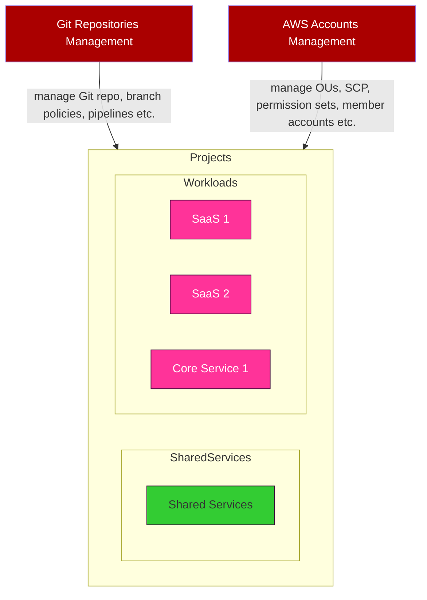
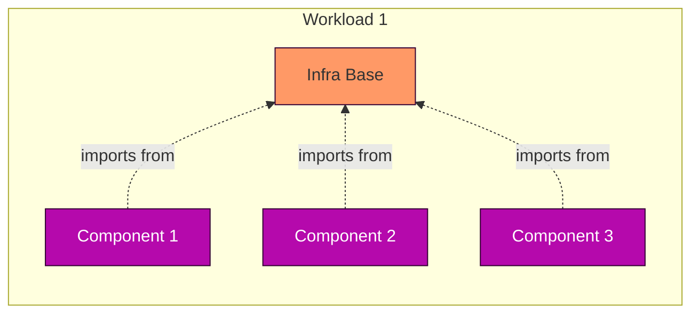
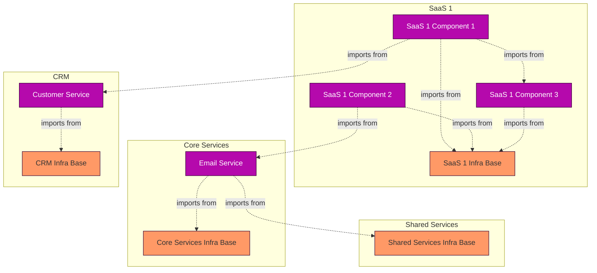

# Foreword

Perhaps it's the banking industry in which I started my IT career, but I've been obsessed with high speed and high quality software delivery ever since I took up platform engineering activities.

Like at any startup, there are few people writing code, and it may be OK for some to leave software delivery disorganized. Not for us.

We build multiple SaaS for businesses at [Xecuta](https://www.xecuta.co.uk) and it was obvious from day 0 that we had to set our solid architecture principles.

It may be our early days, but our architecture principles have already given us the confidence in managing AWS resources effectively.

In the first part of this series, I'll talk about our architecture principles and our design thinking which led us to organize our AWS environments and choose tools and services.

## Xecuta's Architecture Principles

Here's our 10 architecture principles that we agreed before we wrote our first line of code.

1. Build cloud-native and serverless architectures, because we want maximum agility and minimum OpEx from day 0 with a near-linear trajectory for OpEx:Revenue ratio at short-to-medium long term.
2. Build services powered by Amazon Web Services (AWS), because they provide the best public cloud services around cloud-native and serverless architectures.
3. Organize our AWS environment using AWS Organizations and adopt AWS recommended [Basic Organization with infrastructure services](https://docs.aws.amazon.com/whitepapers/latest/organizing-your-aws-environment/basic-organization.html#basic-organization-with-infrastructure-services) pattern
4. Use infrastructure-as-code for not only anything-on-cloud, but also to provision and manage

- AWS accounts
- Git repositories
- CI/CD pipelines

5. Security from day 0
   - Use SSO to access anything
   - Use free or low-cost security services where possible
6. Use Open Source Software from day 0
7. KISS (Keept It Simple, Stupid)
8. Adopt [The Twelve-Factor App](https://12factor.net/) methodology
9. Continuous Delivery from day 0
   - Use Static Code Analysis from day 0
   - Adopt [trunk-based development](https://trunkbaseddevelopment.com/) with branch-to-release strategy
   - Multi git-repo strategy with isolated and independent CI/CD pipelines
   - Re-build and re-deploy untouched code every 3 months
10. Build once deploy many with immutable build artefacts
    - Use conventional commits at all times
    - Use automation for semantic versioning and generating CHANGELOG
    - Use package managers like npm or pip to manage code dependencies

> Re: #3: You may want to look at [Basic organization with CI/CD as a separate function](https://docs.aws.amazon.com/whitepapers/latest/organizing-your-aws-environment/basic-organization.html#basic-organization-with-cicd-as-a-separate-function) as well, but we decided to make Infrastructure OU enclose Deployments OU for simplicity.

## How it's going so far

At the time of writing, Xecuta has:

- 15 AWS Accounts
- 30+ Git repositories, which also means
  - 30+ Build jobs
  - 30+ CI/CD pipelines
  - 30+ On-Demand Deploy pipelines
- 2 separate multi-tenant SaaS offerings
  - 3 environments for each
  - Multiple SaaS customers for each
- Code Quality from day 0
  - Static Code Analysis with at least 80% Code Coverage, we pay €11/month
  - OSS Vulnerabilities and OWASP 10 security scanning
  - Policy-as-code for infrastructure-as-code
- 7,000+ lines of all code

> We are just 1 full-time and 1 part-time developers \
> AND AWS bill for **non-workload OUs** last month was only **$19.90**

---

## Plan from Day 0

First, let's talk about how we organize our AWS accounts and resources.

Assume we have a single AWS account, which becomes our AWS Organizations management account and we configure our IAM Identity Center to enable SSO.

With respect to our principles #3 and #4, we want all organization OUs and member accounts to be managed by infrastructure-as-code.

For this purpose, we have 2 single infrastructure-as-code Git repositories:

- AWS Accounts Management
- Git repositories Management

Our system administrators should be able to apply infrastructure-as-code changes from their local workstations, which will be authorized by temporary credentials issued by SSO (IAM Identity Center).

```mermaid
flowchart TD
  A["Git Repositories Management"]:::mgmt
  B["AWS Accounts Management"]:::mgmt
 subgraph Projects ["Projects"]
    subgraph SharedServices
        Projects_A["Shared Services"]:::ss
    end
    subgraph Workloads
        direction LR
        Projects_B["SaaS 1"]:::wl
        Projects_C["SaaS 2"]:::wl
        Projects_D["Core Service 1"]:::wl
    end
  end
  A -- manage Git repo, branch policies, pipelines etc. --> Projects
  B -- manage OUs, SCP, permission sets, member accounts etc. --> Projects
  classDef ss fill:#33cc33, stroke:#303;
  classDef wl fill:#ff3399, color: #fff, stroke:#303;
  classDef mgmt fill:#aa0000, color: #fff;
```

I leave "Shared Services" to Part 2 of the series, as I plan to get into a lower level with more code.

For the time being, let's assume we have a Shared Services account, it has the basic architecture set up and it provides some level of build and deployment capabilities.

---

## Workload Infra Base

Our design thinking on how we should organize our AWS resources led us to several questions, such as:

- If a KMS key is used to encrypt and decrypt messages across all SQS queues in an AWS account, where should the key be maintained and who should maintain it
- There may be some AWS services like VPCs that our developers can be hands-off and we may want to restrict their maintenance to a smaller set of people, such as DevOps engineers only
- We must avoid cyclic dependencies and how can we control this in an ecosystem with many microservices
- We may want to keep the number of dependencies between microservices at a minimum so they continue to be easily disposable

**Workload Infra Base** is our answer to this problem.

A workload can be either a SaaS or a core service. A core service, such as CRM or Invoicing, is part of the company's platform, which serves all SaaS offered by the company.

A component represents a microservice, or a miniservice, in which we manage only the **compute** resources, gateways and event mappings. Anything else is managed in Workload Infra Base, which can be one or more infrastructure-as-code repositories.

For example, if we think of a typical AWS serverless application:

- Infra Base manages Route 53 zone, ACM certificate, KMS key, all IAM roles including Lambda function execution roles, DynamoDB tables, SQS queues, S3 buckets, EventBridge Bus, Pipe etc
- The component manages the API Gateway and Lambda function. It imports / references ARNs of IAM roles, DynamoDB tables, SQS queues, S3 buckets etc. so it can define event mappings and add IAM policies for its implicit resources to access the _referenced_ AWS resources

```mermaid
flowchart TD
 subgraph subGraph0["Workload 1"]
    direction BT
        A["Infra Base"]:::base
        B["Component 1"]:::cmp
        C["Component 2"]:::cmp
        D["Component 3"]:::cmp
  end
    B -. imports from .-> A
    C -. imports from .-> A
    D -. imports from .-> A
classDef base fill:#f96, stroke:#303;
classDef cmp color:#fff, fill:#b509ac, stroke:#303;
```

Assume we have a CRM system, in which Customer Service exposes an API for our web apps as well as backends of SaaS applications to get customer details. Hence, we want our Components to import resources from other components, even from those outside their own workloads, too.

In another scenario, we may want to have a centralised Email microservice in our Core Services, and we'd like it to use SES identity domain, which is environment-agnostic therefore managed outside our workloads, in our Shared Services.

In short, resources can be both intra-workload and inter-workload dependencies.

```mermaid
flowchart TD
 subgraph SGA2["Shared Services"]
    C["Shared Services Infra Base"]:::base
  end
 subgraph SGA3["SaaS 1"]
    direction LR
    D["SaaS 1 Infra Base"]:::base
    E["SaaS 1 Component 1"]:::cmp-. imports from .-> D
    F["SaaS 1 Component 2"]:::cmp-. imports from .-> D
    G["SaaS 1 Component 3"]:::cmp-. imports from .-> D
  end
 subgraph SGA4["Core Services"]
    M["Core Services Infra Base"]:::base
    N["Email Service"]:::cmp-. imports from .-> M
  end
 subgraph SGA5["CRM"]
    K["CRM Infra Base"]:::base
    L["Customer Service"]:::cmp-. imports from .-> K
  end
    E -. imports from .-> G & L
    F -. imports from .-> N
    N -. imports from .-> C
classDef base fill:#f96, stroke:#303;
classDef cmp color:#fff, fill:#b509ac, stroke:#303;
```

---

## Inter-Workload and Intra-Workload Resource Dependencies

Terraform has quickly become the de-facto in infrastructure-as-code but it does not fill the gap between _infrastructure_ and _application code_, and that's expected, because it's not designed for software development.

We can use AWS CDK as the singular approach to implement the infra base and components. Since AWS CDK creates CloudFormation stacks, it is possible to import & export resources between CloudFormation stacks, exporting from infra base's stacks and importing into components' stacks.

Whilst this approach has its many pros, there are some important drawbacks of using AWS CDK from our perspective:

1. Import & Export functionality in CloudFormation creates physical dependencies between CloudFormation stacks, and this may cause human interventions during major refactoring activities. Imagine logging into prod environment and deleting CloudFormation stacks manually. That's not going to work for us.
2. Cloud Development Kits like AWS CDK have brought the power of programming languages into infrastructure-as-code, enabling full stack engineering and rapid software development. Enterprises can produce reusable and modular CDK modules as `npm`, `pip`, or `go` packages, but there aren't many reusable CDK modules available in the wider community, whereas there are many production-ready modules available in Terraform today.
3. This is my personal opinion and I'm sure many of you will disagree with this, but Id don't buy into using programming languages for infrastructure-as-code. Although I've been using AWS CDK for my other projects lately, I'm still an advocate of using more limited and strict languages like YAML for infrastructure-as-code. I believe "The best code is no code at all" is true for infrastructure-as-code. Even the simplest programming language brings some complexity overhead; you need more knowledge to write good code in a programming language and you also need to perform maintenance for runtime environment upgrades. With HCL or YAML, there is not much of a major room for any runtime upgrades or weird runtime errors or any unintended behaviours.

Third is a personal opinion. We could have lived with the first drawback, but the second one is the deal breaker. We're quite limited on resources (people and time); we can't maintain 1000s of lines of infrastructure-as-code to reinvent the wheel.

An alternative could be "CDK for Terraform", but we are not comfortable with living on the cutting edge; as CDKTF "may still have breaking changes before its 1.0 release".

We could also look into [Pulumi](https://www.pulumi.com/docs/concepts/vs/terraform/). Its features appear to be very promising, but Terraform's de-facto position within the wider community, was the tiebreaker for us. Limitless reusable modules, and not to mention our existing Terraform knowledge.

---

Obviously, Terraform would not be good enough on its own for software development and testing on our local workstations, so we started experimenting with a hybrid-solution to get the best out of two different worlds:

- We use Terraform to build and manage our workloads' infra base
- We use AWS SAM to **build and package but _not to deploy_** our serverless applications
- We wrap SAM projects into isolated Terraform states, which have only one Terraform resource, and that is an [`aws_cloudformation_stack`](https://registry.terraform.io/providers/hashicorp/aws/latest/docs/resources/cloudformation_stack)
- We use [`terraform_remote_state`](https://developer.hashicorp.com/terraform/language/state/remote-state-data) to access workload infra base outputs and pass their values to the underlying CloudFormation stack through CloudFormation parameters

<swiper-container keyboard="true" navigation="true" pagination="true" pagination-clickable="true" pagination-dynamic-bullets="true" rewind="true">
  <swiper-slide></swiper-slide>
  <swiper-slide></swiper-slide>
</swiper-container>

    Swipe left to see how our pipelines work in our hybrid solution.

Thanks to trunk based development, strict conventional commits and automated semantic versioning, our builds produce immutable builds that we build once and deploy many. CD pipelines understand the target environment from the artefact version and perform Terraform plan & apply, which actually does CloudFormation stack create/update in the background.

Finally, if the Workload Infra Base gets very big, we can split into 2 or more repositories and orchestrate their deployments using [Terragrunt](https://terragrunt.gruntwork.io/).

We were quite happy with our experiment and decided to follow this pattern in building SaaS at Xecuta. I understand our approach may seem too complex or unnecessary for some, but again, best out of two worlds!

- Thanks to Terraform, we are able to reuse terraform modules produced by the community and this keep LoC of our infrastructure-as-code low
- Thanks to AWS SAM, we can develop and test locally
- And we can manage inter-workload and intra-workload dependencies in a consistent and reliable manner

I hope you enjoyed my first blog post about Workload Infra Base pattern with hybrid implementation using AWs SAM and Terraform.

Part 2 of this series will continue with which SCM and Orchestration tool(s) we opted to use and how we built our Shared Services initially. Until then, ciao!
